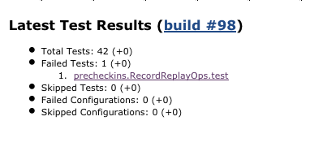
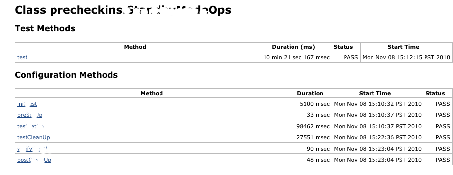
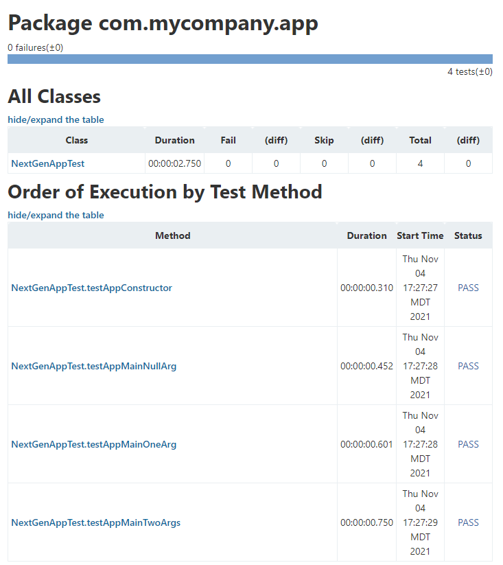
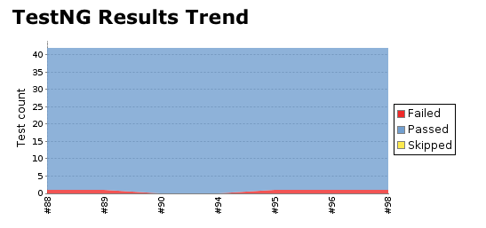

# TestNG Plugin

This plugin allows you to publish TestNG results generated
using `org.testng.reporters.XMLReporter`. TestNG result xml file contains
more information than the junit report xml file . This plugin exposes
those extra information in graph and table reports.

This plugin makes it possible to import TestNG XML reports from each
build into Jenkins.

The data is parsed using the output generated using
`org.testng.reporters.XMLReporter`. The results are displayed with a
trend graph and all details about which tests that failed are also
presented.

## Features

The page layouts are intentionally designed to look very similar to
Jenkins's JUnit plugin.

-   In the project/build page you can see a summary of passed/fail tests
    as well as passed/fail configuration methods. It also enlists the
    failed test cases with a direct link to view the test failure.



-   In the Class result summary page test methods are separated from
    configuration methods



-   In the Package result summary you can see the order which test
    methods were ran during the regression run.



-   Different graphs will show you the pass/failed trend of job's
    previous results.



-   Able to hide/expand tables that display package and class results

## Usage

Once you have configured your build to run TestNG based test cases and
also generate the TestNG specific result XML, using this plugin is very
simple. In **Post-Build Actions**, simply enable **Publish TestNG
Results**. This option allows you to configure the following properties:

-   **TestNG XML report pattern**: This is a file name pattern that can
    be used to locate the TestNG XML report files (for example
    **\***/target/testng-results.xml\*). The path is an Ant-style
    pattern (e.g. fileset) or a list of files and folders separated by
    the characters '***;:,***'. TestNG must be configured to generate
    XML reports using \_org.testng.reporters.XMLReporter \_for this
    plug-in to function.
-   **Escape Test Description string?**: If checked, the plug-in escapes
    the description string associated with the test method while
    displaying test method details. Unchecking this allows you to use
    HTML tags to format the description. (*enabled by default*).
-   **Escape exception messages?**: If checked, the plug-in escapes the
    test method's exception messages. Unchecking this allows you to use
    HTML tags to format the exception message e.g. embed links in the
    text. (*enabled by default*)
-   **Show Failed Builds?**: If checked, the plug-in includes results
    from failed builds in the trend graph. (Disabled by default). 
    -   If this is a maven build, it is better to configure the build
        step with `-Dmaven.test.failure.ignore=true` option. This
        results in build with test failures being marked as Unstable,
        thus distinguishing it from build that failed because of non
        test related issues 
    -   Even when this option is selected, failed builds with no results
        and aborted builds will not be displayed in graphs
-   **Mark build as unstable on Skipped config/test methods?**: Marks
    the build unstable of skipped configuration or test methods are
    found in results. If build result is worse that UNSTABLE, this
    option has no effect
-   **Mark build as failure on failed configuration?**: Marks the build
    as failed if there are any configuration method failures
-   **Thresholds for marking the build as Unstable/Failed**: User can
    configure a Threshold Mode as number of tests or percentage of tests
    and then configure these values separately as well. This allows for
    scenarios where we want the builds to be marked successful even when
    there are some test failures or mark the build as failed even if
    there is a single test method failure.

### Pipeline in Jenkinsfile

```
  post {
    always {
      step([$class: 'Publisher', reportFilenamePattern: '**/testng-results.xml'])
    }
  }
```